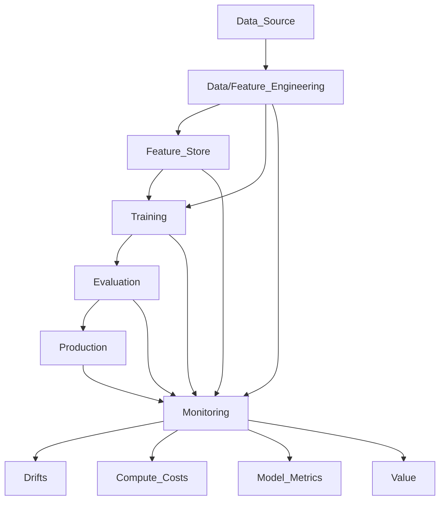

# Revenge Spending with Credit Cards

After analyzing the data, I built a target that defines if a transaction is likely to be characterized as "Revenge Spending", the act of spending money with superfluous things considering their financial information available through the card. This is an example of how we could impact the customers by enhancing their experience with this knowledge.

We can explore this idea further, but for now the pipeline will define the target through the single file made available, creates a pipeline with the structure to evolve into something robust, stores the model object and serves a prediction service through a REST api.

The api is defined in the Dockerfile, that for the sake of simplicity, also performs the data engineering and model training processess before serving. This is a minimal demonstration of what we can accomplish through MLOps practices.

## Running the Project

Docker is required.

If you are able to use Make and sudo:

```bash
make build
```
then:
```bash
make run
```

Docker commands, in case you can't use make:
```docker
docker build --no-cache -t test .
docker run -d --name app_container -p 8000:8000 test
```
This is a recipe to build and run your image exposing it to port 8000

Go to your browser, if everything is running fine 

you can access this [URL](http://localhost:8000/docs#/default/predict_predict_post) to test out the model prediction route:


Click Try it out, roll down a bit then click Execute. It will send the sample data and infer if the transaction was either a "revenge spending" event or not. It will be showed in the response body:


Feel free to contact me and discuss it further.

### The Minimal MLOps Ecosystem



# Machine Learning Operations

With all the efforts to collect data and make it available, machine learning is one of the ways to create value from it. MLOps practices facilitates having a modular process from data source to model serving.

Here I will describe the minimal design to create a realiable pipeline and suggest some of the technologies that can be applied.

# Data Preparation

Organizing your data pipelines to be efficient, requires deep knowledge from your data sources and necessities for your core business. As a starting point, make sure it is available on a reliable and regular time frame. Usually it's cheaper to start with a daily update, making sure you backfil with all the previous existing data.

Some concerns before talking about shipping it to a data platform, like Databricks, Snowflake etc... is to add a security layer over it, in Finance for example, anoymizing the data is super important, observing data protection laws, that can vary according to the country you are working with.

With that in mind you can adopt some best practices regarding computing and storage. For the example file that describes transactions of a credit card. Depending on the necessity of how fresh the data must be for our use cases. Mostly we will choose to process such data with a batch or streaming strategy. For batch we have to define our computing and schedule jobs on a coherent time schedule in tools like airflow, if we need it near real time, we can adopt event streaming through kafka or other pub/sub like technologies.

For the example here, definition is enough:

n_files(csv) -> daily job to update -> pyspark -> features -> parquet/partitioned data -> available raw/features

  Hint: We can clearly take advantage of this pipeline to pre-process some features out of the data, making sure we already have them prepared and available for model pipelines.

# Model Pipeline

Now that we have the required data available, it's key that we take in consideration aspects of model evaluation from the very beggining of the pipeline.

Defining the target is extremely important, and observe what is the best option for your use case, for this example we will consider an imbalanced target, meaning it will drive some of our decisions through the model pipeline.

Let's start with simple nodes for this one:

- build (pre-processing raw data)
  - Build the target
  - Check data quality (ex. Great Expectations)
  - Check data distribution and store it (Monitoring Data Drift)
  - Check data leakage
  - Feature selection techniques (reduce dimensionality)
  - Grouping Entities (important for cv)
  - Built a master table, groups/features/target store it for reproducibility (DVC)
  - Split master table holdout/test/train (consider data size)

- train (model selection and training)
  - Alghoritm selection (perform train with samples to select the best performance)
  - Hyperparam optimization with gridsearch or randomsearch
  - Store a model version together with the DVC. You can store it as an experiment pickle.
  - Proba Calibration (if suitable for estimator)

- evalute (define model quality)
  - Plots (Store with model versioning):
    - Standard Model Metrics (compared against baseline model)
    - Learning Curve (reduce dimensionality)
    - Lift Curve (Identifying best probas)
    - Confusion Matrix (Prevent bad usage of model predictions)
  - Model Competition (if it's not the first one)
    - Check all the previous models with thresholds to define the best one to be promoted
  - New model artifact stored and promoted to production!


# Model Serving (a.k.a Production)

We here either go for batch processing with necessary computing resources, no secrets, could be through airflow, cronjobs, or any other tech of this type. Our we could serve this through a REST Api to have a ready to serve model for any event archtecture, this can be hosted at a Kubernetes or other scalable compute resource, that we can scale horizontally if necessary, and when it is not necessary, we can scale down and make sure we only expend the required resources depending on the demand.

Either way we have to store our models with proper versioning, MLFlow is a good choice, and we also have managed instances through many data platforms like databricks, this will allow us to serve the model as we please from a good source of availability.

Here we can also apply techniques to better measure model efficiency and revenue generated by it, from A/B testing, MAB, or model competition. This infrastructure can apply such concepts easily.

# Monitoring

Throughout the whole description, it is clear that we can monitor many aspects of the model pipeline, from the data conception, to the model serving. It is very important to define the priorities of the business and use case involved. We can set thresholds and alarms accordingly, making sure we can trigger re-train of the model, rollback to a previous version, or promote new ones.

Utilizing your resources with maximum efficiency will be the competitive edge for ML specialists.

Measuring results real-time can also lead to new models, re-evaluation of target and other definitions, this is an extensive area and I'm looking forward to contribute!
